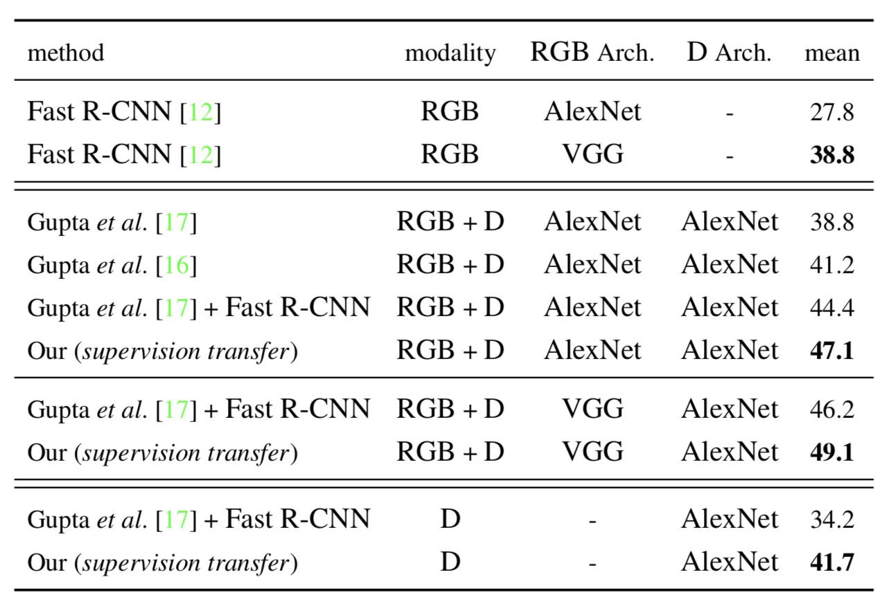

## knowledge distillation method (paper notes)

##### *Combining labeled and unlabeled data with co-training 1998*
这篇文章是想对网页做分类，但是标注过的数据太难取得。一个网页有两部分定义，一部分是网页自身的内容，一部分是别的网页关于他的评价(超链接)，于是作者把这两部分内容分开，用少量的数据分别对这两部分训练两个分类器，然后用这两个分类器对大量unlabeled数据处理后，把产生的结果用于对方的训练。

本来人们只想多多利用未标注的数据，后来Caruana觉得，为什么不用这些大量的新数据去训练一个小模型呢？

##### *Model Compression, Rich Caruana, 2006*

这篇文章主要解决的是，在用小模型模仿大模型过程中数据太少的问题，尝试了三种生成新训练数据(unlabeled of course)的方法，对于输出层的模仿是用的大模型和小模型最后softmax前的logits的root-mean-square-error(RMSE),再具体论文里没有过多给出。这篇论文用于模型压缩的部分是非常original的，但是一个是作者自己没有深挖（个人见解），一个是当时人们也不重视(39 citation)。知道hinton想出了knowledge distillation之后他才发现原来已经有人尝试过了。

##### *Distilling the Knowledge in a Neural Network*

**动机**
1. knowledge distillation
模型的训练和使用上的需求不同。训练追求高准确率，使用追求更少计算量，更小的内存。
2. ensemble
不同的初始值，不同的结构，不同的训练数据会产生不同的模型，这些不同的模型都会有不同的错误(过拟合、欠拟合etc），当把这些模型的结果合并到一起时，错误一定程度上会有所抵消。

**方法**
1. soft target
如果输出是softmax，目标y通常是只有一个1剩余全为0的独热编码,这也称为**hard target**。我们可以把大模型（ensemble）的每个输出的平均值除以一个“temperature”，来获得一个更加“软”的分布。

分类结果的软目标里面有巨量的信息，这些信息就藏在各个分类值的差距中，它们的相对概率。比如狗的信息一部分就藏在分类排名第二的猫中。如果一个老师需要解释狗是什么，用猫来做类比会比什么信息都不提供，有用得多。软化目标就是把这些相对概率暴露出来给学生看。
logn bit的约束
2. 如何平均模型得到输出z？
两种方法，几何平均和算术平均 
3. 和Caruana方法的比较
当T越大，损失函数的梯度就越小。如果这种情况下，我们用1+ε来近似e^ε,这时Caruana的方法就能够被看成是hinton的特例

4.  利用soft target的共同进步策略（这个名字是我自己瞎编的）

打个比方，第一种学习就是，同一张卷子，一帮人独立完成（不共享参数），最后取他们的平均分；
第二种学习方法就是每个人独立思考（同样没有weight sharing），然后在每道题做完了大家交流一下心得，如此做完这张卷子，再求平均分。
hinton视频地址: https://www.youtube.com/watch?v=EK61htlw8hY&t=383s

##### *FitNets: Hints for Thin Deep Nets*
fitnets的思路很简单，就是在hinton的基础上，用大网络中间的隐层作为小网络中间层的“启发层”(hint)。这里有一个两者隐层大小不一致的问题，把小网络中间层加了一个regressor，map到和大网络一样的尺寸。
于是一共就有了两个loss：

上面这个是输出层的蒸馏损失

这个是中间层的启发损失
具体结构这张图就够了

训练细节
1. TeacherNet选择大的网络（goodfellow：maxout），论文中均提取第二层的权值，权值进行fine tuning。
2. StudentNet构建新的网络，提取最中间层的权值，从头训练，权值初始化要求如下：
>All FitNet parameters were initialized randomly in U(-0.005,0.005). We used stochastic gradient descent with RMSProp (Tieleman & Hinton, 2012) to train the FitNets, with an initial learning rate 0.005 and a mini-batch size of 128. Parameter λ in Eq. (2) was initialized to 4 and decayed linearly during 500 epochs reaching λ = 1. The relaxation term τ was set to 3.

##### *Cross Modal Distillation for Supervision Transfer*
这篇文章对不同模态图片做监督迁移学习，两种模态中一种有标注，一种没有标注，将标注过的图片训练获得的网络的中层(mid-level)特征作为未标注图片训练的约束、监督。文章做了RGB图片（labeled）到depth（unlabeled）和optical flow（unlabeled）图片的监督迁移，实验的结果证实跨模态的监督迁移能带来大幅度的性能提升。

>Our technique uses ‘paired’ images from the two modalities and utilizes the mid-level representations from the labeled modality to supervise learning representa- tions on the paired un-labeled modality. 
The recent distillation method from Hinton et al. [22] is a specific instantiation of this general method, where a) they focus on the specific case when the two modalities Ms and Md are the same and b) the supervision transfer happens at the very last prediction layer, instead of an arbitrary internal layer in representation Φ.

他们试验了不同的用于模仿的层，他们发现中间层的效果比较好，因为浅层的网络是modality specific，而中间层更加集中的是图片的内容sementic，objects。

其中在RGBD上mAP从46.2%上升到49.1%。最大的变化是单depth图上mAP从34.2%上升到41.7%。

##### *Do Deep Nets Really Need to be Deep?*
用1M数据点训练一个仅有一个全连接隐层的神经网络，可以达到86%的正确率。如果用一个有三层全连接，一个卷积层，pooling层的网络能达到91%的正确率。这5%的差异的原因有哪些？
猜测：
a) 深网络有更多参数
b) 在相同参数下，更深的网络能够学到更复杂的函数
c) 更深的网络学到更复杂的参数是因为它有更好的bias，学得到更高层次的特征
d) 没有卷积层的网络比不上有卷积层的
e) 当前的学习算法和正则方法更适用于深的网络
f) 以上都是
g) 都不是
用上了模型压缩方法，在相同参数数量情况下，浅网能够达到深网一样的精确，这也意味着深网表达的函数用更浅的网络就能表达。当复杂模型可以被浅层模型来模拟时，就说明复杂模型学习到的函数并不是真正复杂的。模型的复杂性，和模型表达能力的复杂度是两回事。
模型压缩之所以能达到很高的精读，很大部分是因为用了大量unlabeled的数据，数据量最好远远超过训练大模型的数据。这也是为什么作者在06年的文章里更多讲的是获取数据的方法而不是训练的细节的原因。
训练细节：
监督teacher和student model的softmax上一层
>trained directly on the 183 log probability values z, also called logit, before the softmax activation.

这篇论文在2014年，比hinton的文章出的早，用的剥去了softmax的logits来监督小网络的学习。
>We show later that matching the logits of the cumbersome model is actually a special case of distillation. ——hinton

hinton在论文里指出logits mimic是一种特殊的knowledge distillation。

W是隐层和输入层之间的权重，β是隐层和输出层之间的权重
随后文章使用了一种分解矩阵来加速学习的方法，原理需要看给出的引用，如果有需要可以再回头来看。
 
在TIMIT上的实验
 
可以看出，浅网能能够模仿深网，但是和cnn这种经过特殊拓扑改良的网络比起来还有一点差距。不过，给足够多unlabel的数据，浅网还是比较可能赶上深网的。
CIFAR-10实验
>Results on CIFAR-10 are consistent with those from TIMIT. Table 2 shows results for the shallow mimic models, and for much-deeper convolutional nets. The shallow mimic net trained to mimic the teacher CNN (SNN-CNN-MIMIC-30k) achieves accuracy comparable to CNNs with multiple convolutional and pooling layers. And by training the shallow model to mimic the ensemble of CNNs (SNN-ECNN-MIMIC-30k), accuracy is improved an additional 0.9%. The mimic models are able to achieve accuracies previously unseen on CIFAR-10 with models with so few layers. Although the deep convolution nets have more hidden units than the shallow mimic models, because of weight sharing, the deeper nets with multiple convolution layers have fewer parameters than the shallow fully-connected mimic models. Still, it is surprising to see how accurate the shallow mimic models are, and that their performance continues to improve as the performance of the teacher model improves 

模仿大网络是训练小网络防止过拟合的一种方式，比用drop out要好

文章总结了小网络好的两点原因，一个是老师好，一个是数据多。老师更好，给你举得例子越多，你学的越快。

##### *Do deep convolutional nets really need to be deep and convolutional?*
比较了在相同参数条件下，浅网和深网的性能。作者觉得上面那篇论文的实验太粗糙了，低估了卷积层的作用，所以改进了一下实验。

可以看到卷积层的数量对网络的性能有较大影响。具体细节可以翻看论文。
结论：
1. 没卷积层的比不过有卷积层的 
2. 浅网络即使加了一两层卷积层用处也不是很大
3. knowledge distillation是有用的，为什么必须要通过这种方式才能训练小网络原因未知。

##### *Data-Free Knowledge Distillation for Deep Neural Networks*
    不是很明白
    pass

##### *Data Distillation: Towards Omni-Supervised Learning*
[blog](https://zhuanlan.zhihu.com/p/33493383)

##### *Deep Model Compression: Distilling Knowledge from Noisy Teachers*
这篇文章就是用teacher-student模型，用一个teacher模型来训练一个student模型，同时对teacher模型的输出结果加以噪声，然后来模拟多个teacher，这也是一种正则化的方法。

原loss

加噪声

新loss

算法

cifar-10实验

##### *KNOWLEDGE DISTILLATION FOR SMALL-FOOTPRINT HIGHWAY NETWORKS*
TOREAD

##### *PAYING MORE ATTENTION TO ATTENTION: IMPROVING THE PERFORMANCE OF CONVOLUTIONAL NEURAL NETWORKS VIA ATTENTION TRANSFER*
看的不是很明白，用attention作为监督 TOREAD

##### *Distillation as a Defense to Adversarial Perturbations against Deep Neural Networks*
对抗学习，不是很懂，有需要再去仔细看
>In this work, we introduce a defensive mechanism called defensive distillation to reduce the effectiveness of adversarial samples on DNNs. We analytically investigate the generalizability and robustness properties granted by the use of defensive distillation when training DNNs. We also empirically study the effectiveness of our defense mechanisms on two DNNs placed in adversarial settings. The study shows that defensive distillation can reduce effectiveness of sample creation from 95% to less than 0.5% on a studied DNN. Such dramatic gains can be explained by the fact that distillation leads gradients used in adversarial sample creation to be reduced by a factor of 1030. We also find that distillation increases the average minimum number of features that need to be modified to create adversarial samples by about 800% on one of the DNNs we tested.
[blog](https://blog.csdn.net/kearney1995/article/details/79741699)

