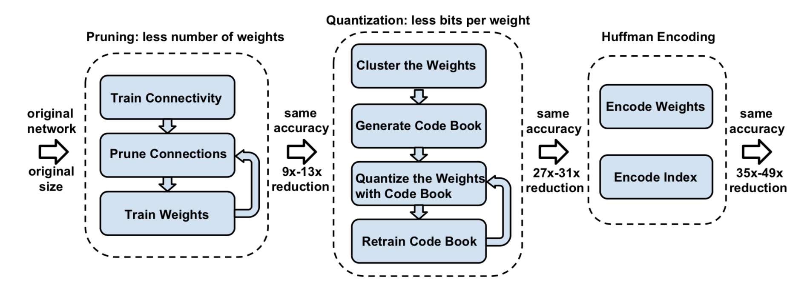
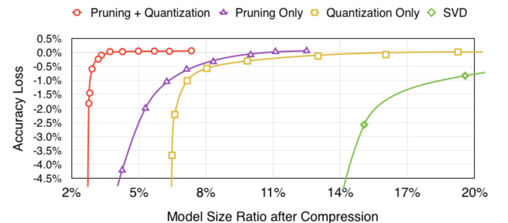

## quantization paper notes

理论依据是：高精度的参数在表现优异的网络中起到的作用并不是非常重要。方法是：通过量化函数将全精度的数（激化量，参数，甚至是梯度值）映射到有限的整数空间，如：n-bit，三值化 (−1,0,+1) , 二值化 (−1,+1) 或 (0,1)。使用量化的网络需要重新训练。随着量化范围（指取值范围）的减少，分类准确率一般会随之降低。一般而言，量化之后网络的需要定制的硬件才能发挥其功效，比较适用于FPGA，ASIC。

### binarization
一类比较特殊的量化的方式，只有(−1,1) 或 (0,1), 可以通过XNOR/AND/POPCNT等位操作指令来替代乘法指令。一方面，二值化网络只有两种取值，相比与等价全精度网络，减少了32倍所需的存储空间。另一方面，替代乘法操作，可以大幅度减少计算量。当然，二值化网络的准确率与全精度网络相比还有一定的差距。

##### *Binarized Neural Networks: Training Neural Networks with Weights and Activations Constrained to +1 or −1*
[这篇博文叙述的比较清楚](https://blog.csdn.net/jackytintin/article/details/53445280)

BNN的激活量和参数都被二值化了, 反向传播时使用全精度梯度。 

根据误差反传算法（Backpropagation，BP），由于 sign(⋅) 的导数（几乎）处处为零，因此，W 通过 BP 得到的误差 ΔW 为零 ，因此不能直接用来更新权值。为解决这个问题，采用直通估计”straight-through estimator(ste)”的方法，用 ΔWb 代替 ΔW。这样，BinaryNet 就可以和序普通的实值网络一样，使用梯度下降法进行优化。 
另外，如果激活值（二值化之前）的绝对值大于1，相应的梯度也要置零，否则会影响训练效果。

BNN中同时介绍了基于移位（而非乘法）的BatchNormailze和AdaMax算法。

**总结**
1. BinaryNet的最大优点是可以用XNOR-运算替代复杂的乘法-加法操作。在小型任务上比如MNIST，SVHN和CIFAR-10几乎达到了顶尖的水平。
2. 至于 BinaryNet 在大型任务上的性能，从ImageNet准确率来看，性能损失还是比较大的，在XNOR-Net中的实验Δ=29.8%。更高的量化精度似是必须的。
3. 在GPU上有7倍加速。
4. 此外，根据实验经验，BinaryNet的训练不太稳定，需要较小的学习率，收敛速度明显慢于实值网络。
5. 可以想象，二值网络的决策边界、拟合曲线是离散的锯齿状的“曲面”

##### *XNOR-Net: ImageNet Classification Using Binary Convolutional Neural Networks* 
BWN(Binary-Weights-Networks) 仅有参数二值化了，激活量和梯度任然使用全精度。XNOR-Net是BinaryNet的升级版。
**主要思想**： 
1. 二值化时增加了缩放因子，同时梯度函数也有相应改变：

2. XNOR-Net在激活量二值化前增加了BN层 
3. 第一层与最后一层不进行二值化 

**实验结果**： 
在ImageNet数据集AlexNet架构下，BWN的准确率有全精度几乎一样，XNOR-Net还有较大差距(Δ=11%) 
减少∼32×的参数大小，在CPU上inference阶段最高有∼58× 的加速。

##### *QNN: Quantized Neural Networks: Training Neural Networks with Low Precision Weights and Activations*
对BNN的简单扩展，量化激活函数，有线性量化与log量化两种，其1-bit量化即为BinaryNet。在正向传播过程中加入了均值为0的噪音。 
BNN约差于XNOR-NET（< 3%），QNN-2bit activation 略优于DoReFaNet 2-bit activation

##### *TWN: Ternary weight networks*
主要思想就是三值化参数（激活量与梯度精度），参照BWN使用了缩放因子。由于相同大小的filter，三值化比二值化能蕴含更多的信息，因此相比于BWN准确率有所提高。

##### *TNN: Ternary Neural Networks for Resource-Efficient AI Applications*
训练时激活量三值化，参数全精度 –> infernce时，激活量，参数都三值化（不使用任何乘法） 
用FPGA和ASIC设计了硬件
##### *TTQ: Trained Ternary Quantization* 
与TWN类似，只用参数三值化，但是正负缩放因子不同，且可训练，由此提高了准确率。ImageNet-18模型仅有3%的准确率下降。

以下是Efficient Processing of Deep Neural Networks: A Tutorial and Survey 中对2016年中通过减少精度的方法来优化网络的方法总结。其中，准确率是指使用AlexNet模型在ImageNet的分类任务中得到的准确率，*是指第一层和/或最后一层仍是全精度的。

##### *Deep Learning as a Mixed Convex-Combinatorial Optimization Problem* 

### quantization

##### *Deep Compression: Compressing Deep Neural Networks with Pruning, Trained Quantization and Huffman Coding*
通过对模型进行剪枝, 量化以及编码, 在几乎不影响网络准确度的情况下,将模型大压缩35~49倍

仔细看了一下，这篇论文好棒！这是第一作者的[报告](https://www.youtube.com/watch?v=CrDRr2fxbsg)
the three stage compression pipeline

神经网络模型通常是over-parametrized,我们通常不需要那么多参数就可以表达出模型特征。有许多研究尝试消除冗余: 
Improving the speed of neural networks on cpus 用定点数以及八位整数激活
Fixed point optimization of deep convolutional neural networks for object recognition 通过L2误差最小化来量化网络, 并且在MNIST和CIFAR-10数据集达到了很好的精确度
Compressing neural networks with the hashing trick 通过低秩矩阵来表示网络权重.
此外, 还有用全局平均池化代替全连接层, 剪枝等方法.

> 1. we start by learning the connectivity via normal network training. 
> 2. Next, we prune the small-weight connections: all connections with weights below a threshold are removed from the network. 
> 3. Finally, we retrain the network to learn the final weights for the remaining sparse connections

>During update, all the gradients are grouped by the color and summed together, multiplied by the learning rate and subtracted from the shared centroids from last iteration.
We use k-means clustering to identify the shared weights for each layer of a trained network, so that all the weights that fall into the same cluster will share the same weight. Weights are not shared across layers.our method determines weight sharing after a network is fully trained

centroid initialization作者实验表明线性初始化最好。

pruning和quantization一起用效果最佳

横坐标是卷积层每个有效权重所占用的比特数，可以看到为了不影响准确度，至少用3个比特就够了（卷积网络至少4个）。图中还比较了量化，量化+剪枝效果,可以发现在量化的条件下，剪枝对精度没有影响。

不同初始化权重的方法比较，可以发现uniform init比较好

